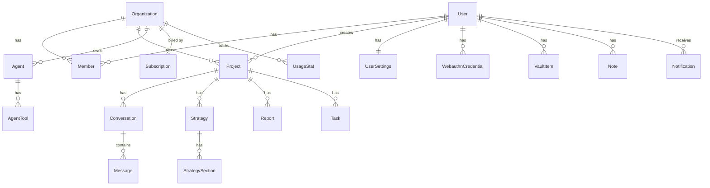

# Vertlix AI — Database Architecture

> **Официальный стандарт базы данных.** Production-ready архитектура multi-tenant AI SaaS.
> Не UI, не frontend, не дизайн — только данные.
>
> **Реальность стека:** продакшн работает на **Supabase (PostgreSQL) + SQL-миграции + RLS**
> (`supabase/migrations/*.sql`), доступ через `@supabase/ssr`. Промпт просит **Prisma** —
> Prisma в рантайме **не используется** (мёртвый `prisma/schema.prisma` был удалён). Полный
> Prisma-контракт предоставлен как **референсная модель**: [`reference-schema.prisma`](./reference-schema.prisma)
> (документация + опция миграции, не рантайм). Дополняет [Technical Architecture](./TECHNICAL-ARCHITECTURE.md).

**Версия 1.0 · 2026-07-22** · масштаб **10K → 10M+**

---

## 1. Database Principles

- **Normalization:** 3NF для транзакционных данных; денормализация точечно (jsonb `ai_results`,
  `metadata`, `preferences`) там, где схема гибкая/read-heavy.
- **Performance:** индексы под реальные запросы (§16); пагинация курсором; пул соединений (PgBouncer).
- **Security:** RLS на **всех** таблицах; скоуп по `user_id`/`organization_id`; шифрование чувствительного (§17).
- **Scalability:** UUID PK (шардируемо), stateless-приложение, партиционирование hot-таблиц при росте (§20).
- **Data Integrity:** FK с `ON DELETE CASCADE/SET NULL`, NOT NULL, UNIQUE, CHECK, enum-домены.
- **Backup:** Supabase daily + PITR (§19).
- **Migration:** версионированные SQL, forward-only, идемпотентные (`if not exists`) (§20).

---

## 2. Multi-Tenant Architecture

```
Organization  (тенант — граница биллинга и данных)
   └── Workspace* (контекст; в текущей схеме = организация, выделяется при росте)
        ├── Member (User + Role)     ← кто имеет доступ
        └── Project                  ← единица работы
             └── Conversations / Strategies / Reports / Tasks
```

- **Изоляция данных:** shared-database, shared-schema, **tenant-колонка** (`organization_id`/`user_id`) +
  **RLS** — стандарт для 10K→10M (проще, чем schema-per-tenant, дешевле, чем DB-per-tenant).
- **Tenant boundaries:** каждая строка принадлежит организации/пользователю; запросы **всегда**
  скоупятся; сервер использует service-role, но код обязан фильтровать (defense-in-depth).
- **Права доступа:** `members.role` (owner/admin/manager/member/viewer) → §4.
- **Безопасность:** RLS блокирует anon-ключ полностью (§17); при 10M — возможен переход к
  DB-per-large-enterprise-tenant для крупных клиентов (гибрид).

---

## 3. Core Entities — User System

| Таблица | Ключевые поля | Индексы | Constraints |
|---|---|---|---|
| **users** | id(uuid PK), email(uniq), name, password_hash, avatar_url, role, tier, is_verified, email_verified(ts), created/updated | `email`(uniq) | email UNIQUE NOT NULL |
| **user_settings** | user_id(PK/FK), language, timezone, theme, email/push_notifs, two_fa, two_fa_secret_enc, two_fa_backup_codes[], fav_agents[], preferences(jsonb) | PK user_id | 1—1 users, CASCADE |
| **webauthn_credentials** | id(base64url PK), user_id(FK), public_key, counter(bigint), transports[], device_label, last_used_at | `user_id` | CASCADE |
| **webauthn_challenges** | id, user_id/email, challenge, kind(register/authenticate) | — | ephemeral |

**Session / VerificationToken / Device:** NextAuth использует **stateless JWT** + подписанные
HMAC-токены (verify/reset) — БД-таблиц сессий/токенов **нет** (по дизайну). «Device Management»
реализуется через token-version claim (спроектировано, §14 Technical Arch). Passkeys = таблица
`webauthn_credentials` (по сути «devices»).

---

## 4. Organization System

| Таблица | Поля | Роли |
|---|---|---|
| **organizations** | id, name, slug(uniq), owner_id(FK users), plan(free/starter/pro/business/enterprise), created/updated | — |
| **members** | id, user_id(FK), organization_id(FK), **role**, permissions(jsonb), created | owner · admin · manager · member · viewer |

- **Role/Permission:** роль — строка-домен (`members.role`); тонкие права — `permissions` jsonb
  (feature-flags). Матрица прав — [Product Architecture §4](./PRODUCT-ARCHITECTURE.md).
- **Constraints:** `UNIQUE(user_id, organization_id)` — юзер в организации один раз; последний
  owner защищён на уровне приложения.

---

## 5. Project System

| Таблица | Поля | Индексы |
|---|---|---|
| **projects** | id, organization_id(FK), user_id(FK), name, description, industry, stage, goals[], target_revenue, timeframe, overall_score, status(active/archived), ai_results(jsonb), metadata(jsonb), created/updated | `user_id`, `organization_id`, `(organization_id,status)`, `created_at` |
| **tasks** | id, user_id, project_id(FK), title, status, due_date | `user_id`, `project_id` |
| **activity_logs** | id, user_id, organization_id, type, data(jsonb), created | `(user_id,created_at)`, `type` |

Проект связан с Conversations, Strategies, Reports, Tasks (1—N, CASCADE). История изменений —
`activity_logs`. Мягкое удаление предпочтительно (status=archived) перед hard-delete.

---

## 6. AI System Database

| Таблица | Поля |
|---|---|
| **agents** | id, organization_id(FK), name, description, type(ceo/cfo/cmo/coo/cto/analyst/legal/sales/custom), system_prompt, model, temperature(numeric), max_tokens, tools_enabled[], is_active, created/updated |
| **agent_tools** | id, agent_id(FK), name(search/email/create_task/database_query), description, config(jsonb), is_enabled |
| **custom_agents** | (user_id, id) PK, data(jsonb persona), created/updated — per-user свои/клонированные |

Каждый агент: **Identity** (name/type), **Instructions** (system_prompt), **Tools** (tools_enabled +
agent_tools), **Model/Temperature/Limits** (model, temperature, max_tokens), **Permissions**
(org-скоуп + RBAC), **Memory/Knowledge** (§8 — TARGET vector). Agent Usage → `usage_stats`.

---

## 7. Conversation System

| Таблица | Поля | Индексы |
|---|---|---|
| **conversations** | id, user_id(FK), project_id(FK), title, created/updated | `user_id`, `project_id` |
| **messages** | id, conversation_id(FK), role(user/assistant/system), content, tokens_used, metadata(jsonb), created | **`(conversation_id, created_at)`** |
| **message_attachments** 🎯 | id, message_id, storage_key, mime, size | `message_id` |
| **message_feedback** 🎯 | id, message_id, user_id, rating, comment | `message_id` |

- **Streaming:** сообщения пишутся по завершении стрима (токены считаются в `tokens_used` для usage/биллинга).
- **History/Search:** `(conversation_id, created_at)` индекс для ленты; 🎯 FTS/vector для поиска.
- **Export:** GDPR-экспорт собирает conversations+messages по user_id (§21).

---

## 8. Memory System (🎯 vector — планируется)

| Уровень | Таблица | Реализация |
|---|---|---|
| **User Memory** | user_settings + 🎯 memory_chunks | предпочтения ✅ + семантика 🎯 |
| **Project Memory** | project + strategies ✅ + 🎯 chunks | контекст проекта |
| **Agent Memory** | 🎯 memory_chunks(agent-scoped) | долгосрочная память агента |

🎯 **memory_chunks:** `id, org_id, source, content, embedding vector(1536), metadata(jsonb)`.
Требует **pgvector** (Supabase Vector). **Similarity Search:** `ivfflat`/`hnsw` индекс по embedding,
`ORDER BY embedding <=> $query LIMIT k`. Vector IDs = PK строк; metadata для фильтрации по tenant.

---

## 9. Document System (🎯 RAG — планируется)

```
Upload → Storage(S3/Supabase, приватный бакет, signed URL)
  → Processing(очередь) → Extraction(PDF/DOCX/TXT/CSV → текст; OCR images)
  → Chunking → Embedding(vector) → Knowledge Base(document_chunks)
```
🎯 Таблицы: **documents** (id, org_id, folder_id, name, storage_key, mime, size, status),
**folders** (иерархия), **document_chunks** (id, document_id, content, embedding vector, order),
**embeddings** (в chunk). Сейчас: аватары — data-URL в `users.avatar_url` (без бакета); файлов-KB нет.
**Безопасность файлов:** whitelist MIME, лимит размера, приватные бакеты, скоуп по tenant.

---

## 10. Billing Database

| Таблица | Поля | Планы |
|---|---|---|
| **subscriptions** | id, organization_id(uniq FK), plan, status(active/past_due/canceled/paused), provider(lemonsqueezy), external_id, current_period_end | free/starter/professional/business/enterprise |
| **invoices** 🎯 | id, subscription_id(FK), amount_cents, currency, status, external_id, created | — |
| **usage_stats** | id, organization_id(FK), metric, value(bigint), period_start | — |
| **plans / credits** 🎯 | конфиг планов и кредитов (сейчас — в коде `PLAN_*`) | — |

**Реализовано:** план на организации, лимиты серверные (Free = 3 проекта → 402), LemonSqueezy
webhook (HMAC). 🎯 invoices/credits/proration в БД, usage-metering по токенам.

---

## 11. Usage Tracking

`usage_stats(organization_id, metric, value, period_start)` — учёт по метрикам:
**ai_requests · tokens · storage_bytes · projects · agents · members.** Для:
- **Лимитов:** проверка перед действием (проекты/отчёты — уже серверно; `max_reports_per_month` на users).
- **Оплаты:** 🎯 usage-based биллинг (токены × модель).
- **Аналитики:** агрегаты в дашборд/админ (§13).

Инкремент — атомарно (`UPDATE ... SET value = value + n`); период — по месяцу (`period_start`),
сброс лимитов по `limit_reset_date`. 🎯 счётчики в Redis для горячих инкрементов, флаш в БД.

---

## 12. Notification Database

| Таблица | Поля |
|---|---|
| **notifications** | id, user_id(FK), type, title, body, data(jsonb), action_url, read_at, created | `(user_id, read_at)` |
| **notification_preferences** | = user_settings (email_notifs/push_notifs/preferences.notif_details) |
| **email_log / push_log** 🎯 | id, user_id, channel, template, status, sent_at, error | для идемпотентности/ретраев |

---

## 13. Analytics Database

- **Реализовано:** `activity_logs` (события) + **PostHog** (product-события: регистрации, входы,
  AI-использование, конверсии).
- 🎯 Таблицы/потоки: **events**, **page_views**, **user_activity**, **ai_usage**, **product_metrics** —
  предпочтительно в аналитическом сторе (PostHog/warehouse), не в OLTP-БД (чтобы не грузить транзакционную).
- Метрики: DAU/MAU, retention, conversion, churn, LTV, AI cost — [Product Arch §18](./PRODUCT-ARCHITECTURE.md).

---

## 14. Security Database

| Таблица | Логирует |
|---|---|
| **activity_logs** (тип `security.*`) ✅ | входы, смена пароля, 2FA on/off, passkey add/remove, действия |
| **login_attempts** 🎯 | попытки входа (для lockout/анализа) — сейчас rate-limit в памяти/Upstash |
| **api_keys** 🎯 | id, org_id, hash(ключа), scopes, last_used, revoked_at |
| **session_history** 🎯 | активные сессии/устройства (JWT stateless → через token-version) |

**Реализовано:** журнал безопасности (`activity_logs` где `type like 'security.%'`), отдаётся в
Settings/Security. 🎯 login_attempts/api_keys/session_history — при росте и Enterprise.

---

## 15. Prisma Schema

Полный контракт — **[`reference-schema.prisma`](./reference-schema.prisma)**: все модели, enum-ы
(MemberRole, Plan, MessageRole, StrategyKey, SubStatus, TicketStatus, VaultType), relations,
`@@index`, `@@unique`, `@map/@@map` (snake_case), `@updatedAt`, `@db.Uuid/Decimal`, composite PK
(`custom_agents (user_id,id)`), TARGET-модели (documents/chunks/memory с `Unsupported("vector")`).

> ⚠️ Это **референс/модель**, не рантайм: продакшн — Supabase SQL + RLS. Файл в `docs/` (не в
> `prisma/`), чтобы не подразумевать активный Prisma. Best-practices Prisma соблюдены; при желании
> команды — точка старта миграции на Prisma поверх той же Postgres.

---

## 16. Indexing Strategy

| Таблица | Индекс | Зачем |
|---|---|---|
| **users** | `email`(uniq) | вход/поиск по email (каждый логин) |
| **members** | `(user_id, organization_id)`(uniq), `organization_id` | резолв org юзера, список участников |
| **projects** | `user_id`, `organization_id`, `(organization_id, status)`, `created_at` | список проектов юзера/орг, фильтр по статусу, сортировка |
| **messages** | `(conversation_id, created_at)` | лента сообщений диалога (самый частый запрос) |
| **conversations** | `user_id`, `project_id` | диалоги юзера/проекта |
| **agents** | `organization_id`; **custom_agents** `user_id` | каталог агентов тенанта |
| **notes/vault/reports/tasks** | `user_id` (+ `is_deleted` для notes) | списки контента юзера |
| **activity_logs** | `(user_id, created_at)`, `type` | лента активности, фильтр security.* |
| **usage_stats** | `(organization_id, metric, period_start)` | проверка лимитов/агрегаты |
| 🎯 **document_chunks/memory** | `ivfflat(embedding)` | semantic search |
| 🎯 **FTS** | `GIN(to_tsvector(content))` на notes/messages | полнотекстовый поиск |

**Принцип:** индекс = частый `WHERE`/`ORDER BY`/`JOIN`; составные — под конкретный запрос
(leftmost-prefix); не индексировать всё подряд (стоимость записи).

---

## 17. Database Security

- **SQL Injection:** параметризованные запросы (`@supabase/ssr` builder / Prisma) — нет строковой
  сборки SQL. ✅
- **Row Level Security:** RLS **force** на всех 33 таблицах; anon-ключ (в браузере) заблокирован
  полностью; сервер — service-role (bypass RLS) + обязательный скоуп в коде (defense-in-depth). ✅
  (см. миграция `009_rls_lockdown.sql` + SECURITY-AUDIT.md).
- **Encryption:** at-rest — Supabase (диски); in-transit — TLS; app-level — AES-256-GCM для
  `two_fa_secret_enc`, bcrypt(12) для паролей, bcrypt для backup-кодов. ✅
- **Access Control:** service-role только сервер-сайд (не в браузере); секреты в env; ANON-ключ
  бесполезен без RLS-политик. ✅
- **Sensitive Data:** пароли/2FA-секреты/backup-коды никогда в открытом виде; PII минимизирована;
  экспорт/удаление по GDPR (§21).

---

## 18. Performance

- **Pagination:** для больших наборов — **cursor-based** (`WHERE created_at < $cursor ORDER BY
  created_at DESC LIMIT n`) вместо OFFSET (O(1) вместо O(n)); offset — только для малых/админ.
- **Caching:** дорогие агрегаты (дашборд), справочники (план орг), 🎯 кэш AI-ответов — в Redis/Upstash
  (Technical Arch §14); инвалидация write-through + TTL.
- **Query Optimization:** `EXPLAIN ANALYZE` на медленных; избегать N+1 (батч-запросы/джойны); select
  только нужные колонки; jsonb-поля не в горячих фильтрах без индекса.
- **Pooling:** **PgBouncer** (Supabase pooler) для serverless (каждая функция = соединение);
  `directUrl` для миграций. При 1M+ — read-replicas для чтения.

---

## 19. Backup & Recovery

- **Backup Strategy:** Supabase automated daily backups; частота ↑ с планом; логические дампы
  критичного перед крупными миграциями.
- **Point-in-Time Recovery (PITR):** включить на prod (восстановление на любой момент в окне
  ретеншена) — обязательно для SaaS с платежами.
- **Disaster Recovery:** RPO ≤ 24ч (daily) / ≤ минуты (PITR); RTO — восстановление из снапшота;
  runbook DR (кто/как/куда); регулярный **тест восстановления** (бэкап без проверки = нет бэкапа);
  🎯 cross-region реплика для крупного масштаба.

---

## 20. Migration Strategy

- **Формат:** версионированные SQL в `supabase/migrations/NNN_name.sql`, forward-only, идемпотентные
  (`create table if not exists`, `add column if not exists` — как 006/007/008/009).
- **Development:** применяются локально/в preview; ветка = свои миграции.
- **Testing:** прогон на seed-БД в CI (миграции применяются чисто с нуля — обязательный гейт).
- **Production:** применяются контролируемо, в правильном порядке; **RLS-изменения — до** переключения
  ключа (см. деплой-нота 009); zero-downtime (expand→migrate→contract для breaking-изменений колонок).
- **Rollback:** forward-fix предпочтителен; для критичного — снапшот до миграции + PITR.

⚠️ **Найденный дефект (исправить):** в `supabase/migrations/` **два конфликтующих `001`**:
`001_init.sql` (ссылается на `auth.users` Supabase-Auth, `projects.analysis`) и `001_initial_schema.sql`
(своя таблица `users`, `organizations.owner_id/plan`, `agents.type`, `agent_tools`). Приложение
использует **свою `users`** (NextAuth), значит `001_initial_schema.sql` — канонический, а `001_init.sql`
— конфликтующий дубль (риск: неверный порядок применения ломает FK/RLS). **Рекомендация:** консолидировать
в один базовый init (или удалить `001_init.sql`, перенеся уникальное в `001_initial_schema`), проверить
на чистой БД. Не менял автоматически — это влияет на прод-схему и требует вашего подтверждения.

---

## 21. Data Retention & GDPR

- **Удаление данных:** `DELETE /api/user` — GDPR-стирание по всем user-owned таблицам + строка users
  (реализовано). Мягкое удаление (`is_deleted`/`status=archived`) для восстановления, hard-delete по запросу.
- **Экспорт:** `GET /api/user/export` — полный экспорт данных пользователя (реализовано).
- **GDPR readiness:** право на доступ (export), стирание (delete), минимизация PII, AES для секретов;
  🎯 DPA/SOC 2 для Enterprise; ретеншен-политики (авто-удаление старых логов/сообщений по сроку).
- **Пользовательские запросы:** self-service в Settings/Privacy (экспорт/удаление) — без ручного тикета.

---

## 22. Database Monitoring

Отслеживать: **Query Performance** (p95/p99 по запросу), **Slow Queries** (`pg_stat_statements`,
лог > N мс), **Connections** (пул: активные/idle/ожидание — исчерпание пула = деградация),
**Storage** (рост таблиц/индексов, hot-таблицы), **Errors** (deadlock, constraint, timeout).
Источник: Supabase dashboard + 🎯 OTel/Datadog. Алерты: медленный запрос-регресс, пул > 80%,
storage-порог, рост ошибок. Ревью `pg_stat_statements` еженедельно.

---

## 23. Final — резюме

**ER (высокоуровнево):**


**Итог:** enterprise-ready multi-tenant Postgres — RLS на всех таблицах, скоуп по tenant, шифрование
чувствительного, индексы под реальные запросы, курсорная пагинация, PgBouncer, PITR, GDPR-экспорт/
стирание. Путь к 10M — read-replicas + партиционирование `messages` + pgvector для RAG + Redis-счётчики,
без переписывания (модель уже tenant-изолирована).

**Аудит — устранённые/выявленные слабые места:**
1. **Дубль `001`-миграции** (конфликт `auth.users` vs своя `users`) → выявлен, дана рекомендация
   консолидации (§20); не тронул автоматически (влияет на прод-схему).
2. Prisma-иллюзия → рантайм = Supabase SQL/RLS честно зафиксирован; Prisma дан как референс-модель.
3. Vector/RAG/документы → помечены 🎯 (нужен pgvector + storage), не выданы за готовое.
4. Analytics в OLTP → рекомендовано держать event-аналитику вне транзакционной БД (PostHog/warehouse).
5. Хот-таблица `messages` → индекс `(conversation_id, created_at)` + план партиционирования при росте.

---

*Companion: [`reference-schema.prisma`](./reference-schema.prisma) · [Technical Architecture](./TECHNICAL-ARCHITECTURE.md) ·
[Product Architecture](./PRODUCT-ARCHITECTURE.md) · [Security Audit](./SECURITY-AUDIT.md) ·
реальная схема — `supabase/migrations/*.sql`.*
